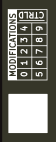

# Design

Design files are all available in `/hardware` of the Ponder repository.

## Appearance

The board is reasonably self-explanatory for most users and is presented as follows:

 

---

## Bill of Materials

The below is an embedded copy of the interactive bill-of-materials, available in `/hardware/outputs/bom`.

[ibom](./assets/v1.0/ibom.html ':include :type=iframe width=100% height=800px')

---

## Schematic

Whilst the majority of the expanded headers are self explanatory, the following is embedded to provide a fuller picture of the board.

Available in `/hardware/outputs`.

```pdf
./assets/v1.0/Ponder.pdf
```

---

## Miscellaneous

The following lists any miscellany.

### Serialisation

Asset tracking is a varied and often business-bespoke mechanism. It is left to the user to implement suitible traceability for their own needs, boards are *not* serialised.

### Board Revision

The board includes a version and revision marker which traces back to the applicable Git commit from which the bareboard was generated.


### Mod Strikes

On the rear of the board, there is a 'MODIFICATIONS' box for tracking board modifications via modification sheets, each assigned a number.
When a board is updated to a particular modification level, mark the corresponding box.



Alternatively, if a board is used in a bespoke way, check the '/CTRLD' box to indicate it is not at a known, or controlled, build level.

>[!TIP]
>The `/CTRLD` box can be useful if you have multiple boards which you're tracking the status of, but you're experimenting heavily with one and are never intending on returning it to a defined build standard.
