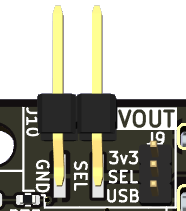

# Features

This page details the feature-set and pin-mapping at a high-level.

## Pinout

?>The following has been reproduced for ease of access, the schematic is the source of truth.

| Function               | Ponder Pico2 | Ponder          |
|:----------------------:|:------------:|:---------------:|
| UART0 TX               | GPIO0        | GPIO0           |
| UART0 RX               | GPIO1        | GPIO1           |
| UART0 LED              | GPIO2        | GPIO2           |
| USR SW                 | GPIO3        | GPIO3           |
| UART1 TX               | GPIO4        | GPIO20          |
| UART1 RX               | GPIO5        | GPIO21          |
| UART1 LED              | GPIO6        | GPIO8           |
| UART2 LED              | GPIO7        | GPIO19          |
| UART2 TX               | GPIO8        | GPIO22          |
| UART2 RX               | GPIO9        | GPIO23          |
| UART3 LED              | GPIO11       | GPIO30          |
| UART3 TX               | GPIO12       | GPIO29          |
| UART3 RX               | GPIO13       | GPIO28          |
| SPI**0** MISO/I2C0 SDA | GPIO16       | N/A             |
| SPI**0** CSn/I2C0 SCL  | GPIO17       | N/A             |
| SPI**0** SCK/I2C1 SDA  | GPIO18       | N/A             |
| SPI**0** MOSI/I2C1 SCL | GPIO19       | N/A             |
| UART4 RX               | GPIO20       | GPIO32          |
| UART4 TX               | GPIO21       | GPIO33          |
| UART4 LED              | GPIO22       | GPIO34          |
| RP_PWR_LED             | GPIO25       | GPIO4           |
| UART5 RX               | GPIO26       | GPIO46          |
| UART5 TX               | GPIO27       | GPIO47          |
| UART5 LED              | GPIO28       | GPIO45          |

  
For completeness -> SPI/I2C mapping for Ponder (Click to Expand)

Ponder Pico2 uses SPI0, Ponder uses SPI1.

| Function               | Ponder Pico2 | Ponder          |
|:----------------------:|:------------:|:---------------:|
| SPI**1** MISO/I2C0 SDA | N/A          | GPIO24          |
| SPI**1** CSn/I2C0 SCL  | N/A          | GPIO25          |
| SPI**1** SCK/I2C1 SDA  | N/A          | GPIO26          |
| SPI**1** MOSI/I2C1 SCL | N/A          | GPIO27          |

---

## Interfaces

The following sections will cover detail of various interfaces across the board.

>[!TIP]
>I _try_ to maintain the logic of not having `hot` supply pins as far as practicable.  
>This means that where possible, anything intended to provide a supply voltage will be in the form of a socket. Conversely, anything to be supplied a voltage will be presented as a header.  
>N.B. J10 is shown in renders as a header - It is a socket in the BoM. Its selection jumper, J9, is a 1.27 pitch for convenience.

---
### LEDS

There are three LEDs on the board which aren't for use with the ISO UARTS, these are:

1. USR - This is a user controllable LED, nominally used to indicate when the MCU has booted into user code
1. USB - This LED is tied to VBUS on the USB connector to indicate presence of power.
1. 3v3 - This is tied to the 3v3 line from the Pico to indicate that the LDO is functional.

### Buttons

#### BOOT

The BOOT button is used to put the MCU into USB bootloader mode in order to load *.UF2 files. Simply hold the button whilst powering on the board, then the board will present as a mass-storage device.

>[!TIP]
>Once booted, the button can act as a user input connected to `GPIO3`.

#### RESET

The reset button resets the device

### USB (J1)

The USB-C connector provides power to the board and is the primary mechanism for programming the board.  
During the boards intended use-case, the USB connector is also used for the data handling for the CDC ACM endpoints (i.e. your PC providing multiple COM ports for accessing each of the UARTs on-board).

---

### Isolated UARTs (J2, J3, J4, J5, J6, J7)

The isolated UARTs are provided by six 4 pin, 2.54 pitch, headers around the edge. The isolators connected to these headers `must` be fed with a voltage and ground reference by **each** device under test, otherwise the UART comms will not be passed to the MCU.

- Supply voltage on VCC for `UART`[`0` .. `5`] is 2.375 .. 5.5V  
   - The isolators are also providing level translation and will support logic from 2v0 to 5v5.

>[!NOTE]
>If you require 1v8 logic -> A drop-in replacement isolator is the [MAX12931](https://www.analog.com/media/en/technical-documentation/data-sheets/max12930-max12931.pdf).  
>This part is significantly higher cost, hence not the default.

---

### I2C / SPI / Breakout (J8, TPs)

The board includes some additional connection options for users to experiment with.

#### J8

J8 _nominally_ provides access to either `SPI0` _or_ `I2C0` & `IC21`. Additionally, the header provides 3v3 supply and GND connections.

J12 .. J15 provides optional pull-up / pull-down configuration for each pin by jumpering the desired end to the centre pin.

>[!TIP]
>These pins could be used for GPIO, for example for triggering wider aspects of a test system.

#### Programming

Test points are provided as an alternative to USB loading.

1. Programming test points are grouped near the MCU.
   1. 

### VOut (J10)

J10 is provided as a convenient power access for lower power devices or for monitoring supply voltages.  
The voltage on J10 can be selected, using J9. The options are 3v3 or USB.

>[!WARNING]
>J10 _could_ be used to power the board, up-to 20V, when jumpered to USB, or a direct 3v3, bypassing the LDO (U1), if required.  
>If powering via the USB jumper option, note that USB LED, D9, is tied to this line and has 1kR in series.
